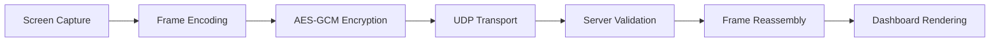

# Project Architecture

## Backend Architecture

* **Framework**: FastAPI (Python) providing REST APIs, WebSocket endpoints, dashboard services, and streaming management.

### Authentication Service (`auth_service.py`)

Responsibilities:

* Ed25519 identity verification
* X25519 key exchange
* Challenge-response authentication
* Session lifecycle management
* Replay protection
* Authentication rate limiting
* Device approval workflow
* Pending device management
* Session expiration and revocation

### Dashboard Authentication (`dashboard_auth.py`)

Responsibilities:

* Dashboard token validation
* Localhost access restrictions
* Administrative API protection
* Dashboard WebSocket authentication
* Audit attribution for administrative actions

### Capture Service (`capture_service.py`)

Responsibilities:

* Configurable screen capture
* Frame acquisition
* Frame preprocessing
* Runtime capture reconfiguration

### Stream Service (`stream_service.py`)

Responsibilities:

* UDP socket management
* Encrypted frame reception
* Packet validation
* Replay protection
* Frame reassembly
* Statistics collection
* Dashboard frame forwarding

### Crypto Service (`crypto_service.py`)

Responsibilities:

* Key generation
* Ed25519 signature verification
* X25519 key exchange
* HKDF key derivation
* AES-GCM encryption utilities

### Device Registry (`device_registry.py`)

Responsibilities:

* Trusted device storage
* Pending device storage
* Blocked device storage
* Recent device history
* Rejected device tracking

### Logger Service (`logger.py`)

Responsibilities:

* Structured audit logging
* Security event logging
* Log rotation
* Dashboard log exposure

---

## Frontend Architecture

### Technology Stack

* React
* Vite
* REST API integration
* Dashboard WebSocket integration

### Dashboard

Responsibilities:

* Device management
* Live stream preview
* Security monitoring
* Stream statistics
* Audit log visualization
* Administrative controls

### Authentication Flow

* Dashboard token extracted from URL
* Token stored locally
* Token attached to API requests
* Token attached to dashboard WebSocket connections

### State Management

* React hooks
* Polling-based API refresh
* Real-time WebSocket updates

### Build System

```text
npm run build
```

Outputs static assets served directly by FastAPI.

---

## Windows Client Architecture

### Entry Point (`main.py`)

Responsibilities:

* Configuration loading
* Logging initialization
* Connection manager startup
* UI initialization

### Connection Manager (`core/connection_manager.py`)

Responsibilities:

* WebSocket authentication lifecycle
* Challenge-response handling
* Session establishment
* UDP streaming setup
* Reconnect handling

### State Machine (`core/state_machine.py`)

Tracks:

* Disconnected
* Connecting
* Authenticating
* Pending Approval
* Connected
* Streaming

### Retry Policy (`core/retry_policy.py`)

Provides:

* Exponential backoff
* Retry limits
* Reconnection timing

### Video Window (`ui/video_window.py`)

Responsibilities:

* Local stream rendering
* FPS display
* Connection status display
* Fullscreen support
* User interaction

---

## Data Flow



### Processing Steps

1. Client captures screen frames.
2. Frames are encoded and compressed.
3. Session keys encrypt frame payloads.
4. Encrypted UDP packets are transmitted.
5. Server validates and reassembles packets.
6. Dashboard receives processed frames.
7. Live stream is rendered in the browser.

---

## Session Lifecycle

1. Client connects to authentication WebSocket.
2. Server issues authentication challenge.
3. Client proves identity using Ed25519 signatures.
4. X25519 key exchange derives session secrets.
5. Session is created.
6. Streaming begins.
7. Session expires or is revoked.
8. Session resources are cleaned automatically.

Security controls:

* Session expiration
* Replay protection
* Session revocation
* Rate limiting
* Nonce validation

---

## Streaming Lifecycle

1. Client captures frames.
2. Frames are encrypted using session keys.
3. UDP packets are transmitted.
4. Server validates packet authenticity.
5. Replay attempts are rejected.
6. Packets are reassembled into frames.
7. Frames are forwarded to the dashboard.
8. Stream statistics are updated.

If UDP initialization fails, the server enters a degraded mode while keeping administrative services available.

---

## Security Controls

Implemented controls include:

* Mutual authentication
* Ed25519 identity verification
* X25519 key exchange
* HKDF-derived session keys
* AES-GCM encryption
* Dashboard authentication
* Replay protection
* Session expiration
* Session revocation
* Authentication rate limiting
* Resource limits
* Device trust workflow
* Audit logging
* Configuration validation

---

## Component Responsibilities Summary

| Component          | Responsibility                       |
| ------------------ | ------------------------------------ |
| Auth Service       | Authentication, challenges, sessions |
| Dashboard Auth     | Dashboard access control             |
| Capture Service    | Screen capture and frame generation  |
| Stream Service     | UDP transport and frame processing   |
| Crypto Service     | Cryptographic operations             |
| Device Registry    | Persistent device trust storage      |
| Logger Service     | Audit and security logging           |
| Dashboard          | Monitoring and administration        |
| Connection Manager | Client connection lifecycle          |
| Video Window       | Local rendering and status display   |
